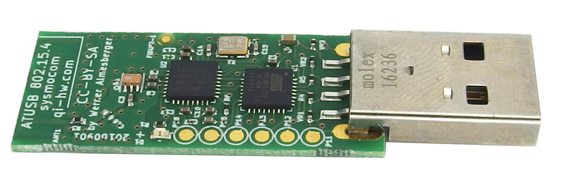

.. _802154_setup:

***************************
IEEE 802.15.4 Network Setup
***************************

Most computers do not come equiped with a built-in
`IEEE 802.15.4 <https://en.wikipedia.org/wiki/IEEE_802.15.4>`_
transceiver, so this setup requires some additional hardware.

We recommend the `ATUSB <http://shop.sysmocom.de/products/atusb>`_,
which is one of the longest-running `OSHW <https://www.oshwa.org/>`_
products out there for IEEE 802.15.4 development.

Simply run the commands below.

.. code-block:: bash

    sudo apt install -y wpan-tools
    sudo modprobe atusb
    sudo iwpan phy phy0 set channel 0 26
    sudo iwpan dev wpan0 set pan_id 0xabcd
    sudo ip link add link wpan0 name lowpan0 type lowpan
    sudo ip link set wpan0 up
    sudo ip link set lowpan0 up
    sudo ip -6 addr add 2001:db8::2/64 dev lowpan0

Additional information can be found `here <https://gist.github.com/cfriedt/9ad6a10250b5098e1aeb25193c2c9ba3>`_.
